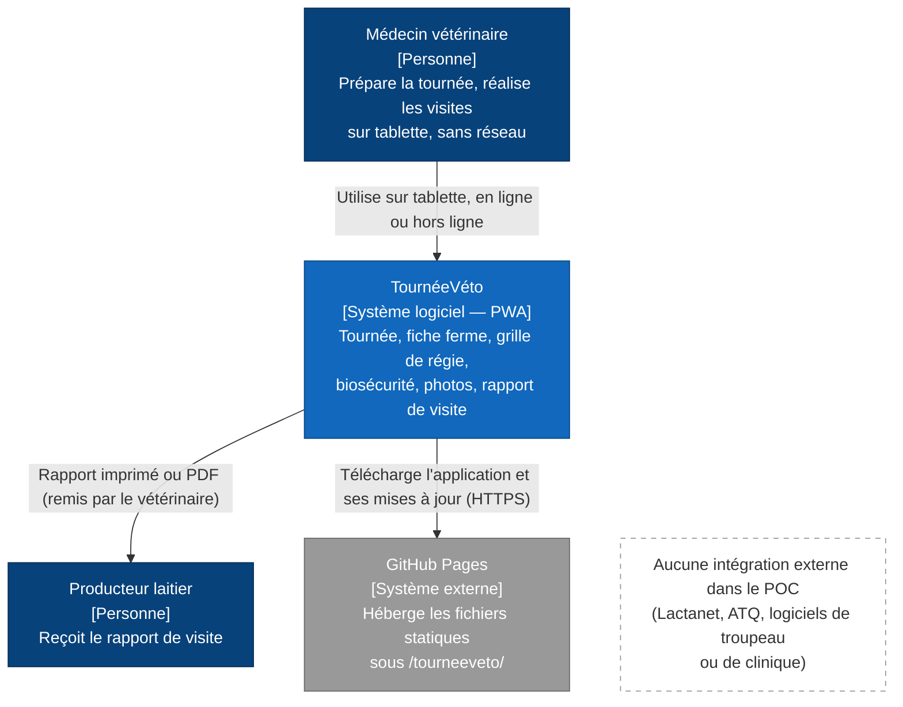
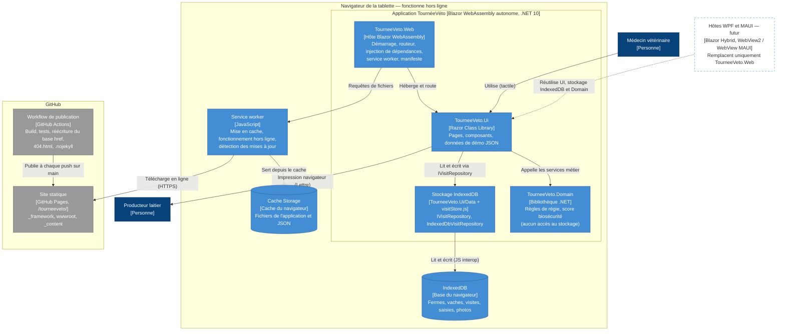

# TournéeVéto — Architecture (C4 niveaux 1 et 2)

> Contexte produit : [PRODUCT.md](../PRODUCT.md) · périmètre : [mvp.md](mvp.md).
> Décisions : [ADR 0001 stockage](adr/0001-stockage.md) · [ADR 0002 structure de la solution](adr/0002-structure-solution.md) · [ADR 0003 hébergement](adr/0003-hebergement.md).

Notation : `flowchart` Mermaid aux conventions C4 (type de l'élément entre crochets). Les syntaxes `C4Context` et `C4Container` de Mermaid sont encore expérimentales et leur rendu chevauche souvent les éléments sur GitHub.

## Niveau 1 — Contexte système

## Niveau 2 — Conteneurs

Au sens strict, l'application Blazor WebAssembly est un seul conteneur. Ses projets (niveau 3, composants) sont montrés à l'intérieur pour rendre visible la frontière de réutilisation : seul `TourneeVeto.Web` change pour WPF et MAUI.

## Rôle de chaque conteneur

- **TourneeVeto.Web** : hôte propre au navigateur (routeur, injection de dépendances, service worker, manifeste). C'est le seul projet remplacé par un hôte WPF ou MAUI.
- **TourneeVeto.Ui** : pages, composants et données de démo JSON, partagés tels quels avec les futurs hôtes Blazor Hybrid.
- **Stockage IndexedDB** : interface `IVisitRepository` et implémentation `IndexedDbVisitRepository` (TourneeVeto.Ui/Data), via le module isolé `visitStore.js` (skill indexeddb-interop). Il vit dans la Razor Class Library, car IndexedDB existe aussi dans WebView2 et dans les WebView de MAUI.
- **TourneeVeto.Domain** : règles métier pures, sans accès au stockage ni dépendance à l'interface ni au navigateur ; testé par xUnit.
- **IndexedDB** : seule source de vérité des données sur l'appareil, photos comprises (en `Blob`). Rien n'est copié ailleurs.
- **Service worker** : met l'application en cache après le 1er chargement, la sert hors ligne et signale les nouvelles versions sans les appliquer d'office.
- **Cache Storage** : copie locale des fichiers `_framework`, des ressources `_content` et des JSON (données de démo, seuils, questionnaire de biosécurité).
- **Site statique (GitHub Pages)** : unique point de distribution, sous `/tourneeveto/`. Il ne reçoit aucune donnée métier.
- **Workflow de publication (GitHub Actions)** : compile, teste, réécrit le base href, crée `404.html` et `.nojekyll`, puis publie, uniquement si les tests passent.
- **Hôtes WPF et MAUI (futur)** : hors POC. Ils remplacent `TourneeVeto.Web` et réutilisent tout le reste.
